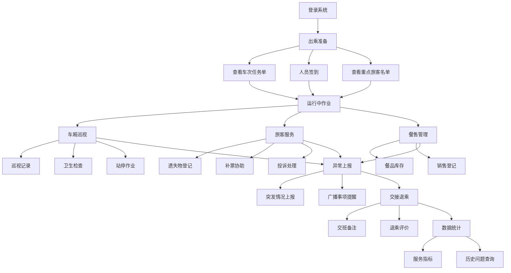

## 1. 产品概述

列车乘务协同 Web 系统是一套面向铁路客运乘务组的数字化协同平台，用于在出乘前后统一处理服务、安全和交接事项，解决传统纸质流转效率低、信息不透明的痛点。
- 目标用户：列车长、乘务员、餐售人员等列车乘务组成员
- 核心价值：实现出乘全流程数字化协同，提升乘务组工作效率与服务质量，确保安全事项零遗漏

## 2. 核心功能

### 2.1 用户角色

| 角色 | 进入方式 | 核心权限 |
|------|----------|----------|
| 列车长 | 分配账号 | 全部页面读写、审核确认、数据统计查看 |
| 乘务员 | 分配账号 | 出乘准备、车厢巡视、旅客服务、交接退乘读写 |
| 餐售人员 | 分配账号 | 餐售管理读写，旅客服务部分读写 |

### 2.2 功能模块

1. **出乘准备**：车次任务单、人员签到、重点旅客名单
2. **车厢巡视**：车厢巡视记录、卫生检查、站停作业清单
3. **旅客服务**：遗失物登记、补票协助、投诉处理
4. **餐售管理**：餐品库存、销售登记
5. **异常上报**：突发情况上报、广播事项提醒
6. **交接退乘**：交班备注、退乘评价
7. **数据统计**：服务指标、历史问题查询

### 2.3 页面详情

| 页面名称 | 模块名称 | 功能描述 |
|----------|----------|----------|
| 出乘准备 | 车次任务单 | 展示当前车次基本信息（车次号、始发/终到站、开行日期、编组信息），任务要求与注意事项 |
| 出乘准备 | 人员签到 | 乘务组成员名单与签到状态，支持一键签到与签到时间记录 |
| 出乘准备 | 重点旅客名单 | 展示需要重点关注的旅客信息（老弱病残孕、特殊饮食、VIP等），支持标记与备注 |
| 车厢巡视 | 车厢巡视记录 | 按车厢记录巡视时间、巡视人、发现情况与处理结果，支持按车厢筛选 |
| 车厢巡视 | 卫生检查 | 各车厢卫生评分与检查项（地面、座椅、卫生间、垃圾桶），支持拍照上传与评分 |
| 车厢巡视 | 站停作业清单 | 各站到发时刻与站停期间作业项目（开关门、旅客上下车、行李搬运），逐项确认 |
| 旅客服务 | 遗失物登记 | 登记拾得的遗失物品信息（物品描述、拾得位置、拾得时间、交接状态） |
| 旅客服务 | 补票协助 | 记录旅客补票需求与处理状态（无票乘车、越站、变更席别），关联车厢与座位号 |
| 旅客服务 | 投诉处理 | 登记旅客投诉内容、分类、处理措施与旅客反馈，支持跟进状态追踪 |
| 餐售管理 | 餐品库存 | 实时查看各品类餐品库存数量，支持入库与消耗登记，低库存预警 |
| 餐售管理 | 销售登记 | 记录每笔销售明细（品名、数量、金额、支付方式、车厢号），支持日结汇总 |
| 异常上报 | 突发情况上报 | 上报各类突发事件（设备故障、旅客突发疾病、安全威胁等），含时间、地点、描述、紧急程度与现场照片 |
| 异常上报 | 广播事项提醒 | 按时间线展示需广播的事项（到站提醒、寻人启事、安全提示等），支持标记已播 |
| 交接退乘 | 交班备注 | 记录交班时需特别说明的事项（未处理问题、重点旅客变动、设备异常等），接班人确认签收 |
| 交接退乘 | 退乘评价 | 对本次出乘整体评价（服务质量、团队配合、安全合规），填写退乘总结 |
| 数据统计 | 服务指标 | 展示关键服务KPI（准点率、投诉率、遗失物归还率、补票收入、销售总额等），图表可视化 |
| 数据统计 | 历史问题查询 | 按时间、车次、类型等条件查询历史异常事件、投诉记录与交接事项 |

## 3. 核心流程

用户登录系统后，按照"出乘准备 → 车厢巡视/旅客服务/餐售管理 → 异常上报 → 交接退乘"的主线流程开展工作，各环节产生数据汇入数据统计页面。

## 4. 用户界面设计

### 4.1 设计风格

- **主色调**：深蓝 #1a365d（沉稳、专业、铁路行业感），辅以天蓝 #3b82f6 作为操作强调色
- **次色调**：琥珀色 #f59e0b 用于告警/重点标记，翡翠绿 #10b981 用于完成/正常状态
- **按钮风格**：圆角矩形，主操作按钮深蓝底白字，次要操作浅底深蓝字
- **字体**：标题使用 Noto Sans SC Bold，正文使用 Noto Sans SC Regular
- **布局风格**：左侧固定导航栏 + 右侧内容区，卡片式模块布局
- **图标风格**：线性图标（lucide-react），与铁路运营系统的专业感匹配

### 4.2 页面设计概览

| 页面名称 | 模块名称 | UI元素 |
|----------|----------|--------|
| 出乘准备 | 车次任务单 | 卡片式布局，顶部车次信息横幅，任务项列表，注意事项标签 |
| 出乘准备 | 人员签到 | 网格头像卡片，签到按钮，实时签到率进度条 |
| 出乘准备 | 重点旅客名单 | 表格列表，类型彩色标签，备注展开行 |
| 车厢巡视 | 车厢巡视记录 | 时间轴布局，按车厢Tab切换，记录卡片含状态徽章 |
| 车厢巡视 | 卫生检查 | 检查项评分矩阵，星级评分，进度指示器 |
| 车厢巡视 | 站停作业清单 | 站点卡片序列，作业项勾选列表，倒计时提醒 |
| 旅客服务 | 遗失物登记 | 表格+新建表单弹窗，状态流转标签，搜索筛选 |
| 旅客服务 | 补票协助 | 表格列表，快速录入表单，金额汇总卡片 |
| 旅客服务 | 投诉处理 | 看板式列表（待处理/处理中/已解决），优先级色标 |
| 餐售管理 | 餐品库存 | 分类Tab，库存卡片（含进度条），低库存红色预警 |
| 餐售管理 | 销售登记 | 快速录入表单，实时统计面板，日结汇总表 |
| 异常上报 | 突发情况上报 | 紧急上报大按钮，上报表单，紧急程度色标，时间线 |
| 异常上报 | 广播事项提醒 | 时间线列表，已播/待播状态切换，新增广播表单 |
| 交接退乘 | 交班备注 | 事项列表，新增备注表单，接班人确认签收按钮 |
| 交接退乘 | 退乘评价 | 评分星级组件，多维度评价项，总结文本框 |
| 数据统计 | 服务指标 | 数据卡片组，折线图/柱状图/饼图，日期范围筛选 |
| 数据统计 | 历史问题查询 | 搜索筛选栏，结果表格，详情弹窗 |

### 4.3 响应式设计

- 桌面优先设计，最小宽度 1024px
- 平板适配：侧边栏可折叠为图标模式
- 触控优化：按钮与操作区域最小 44px 点击热区

### 4.4 3D 场景

不涉及 3D 场景
