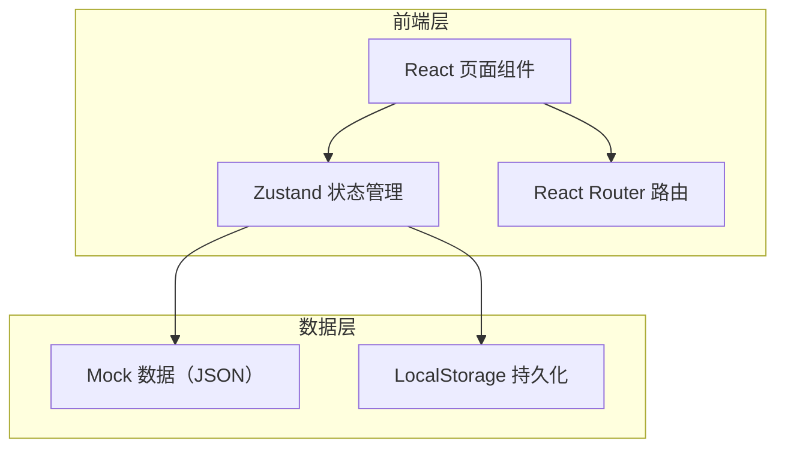
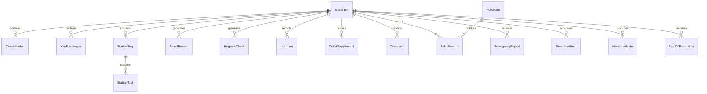

## 1. 架构设计



本项目为纯前端应用，使用 Mock 数据模拟后端接口，数据通过 LocalStorage 持久化。

## 2. 技术说明

- **前端框架**：React@18 + TypeScript + Vite
- **样式方案**：Tailwind CSS@3
- **状态管理**：Zustand
- **路由方案**：React Router DOM v6
- **图表库**：Recharts
- **图标库**：lucide-react
- **后端**：无（纯前端 + Mock 数据）
- **数据库**：LocalStorage

## 3. 路由定义

| 路由 | 用途 |
|------|------|
| / | 重定向到 /preparation |
| /preparation | 出乘准备页面 |
| /patrol | 车厢巡视页面 |
| /service | 旅客服务页面 |
| /catering | 餐售管理页面 |
| /incident | 异常上报页面 |
| /handover | 交接退乘页面 |
| /statistics | 数据统计页面 |

## 4. API 定义

本项目不使用后端 API，所有数据通过 Zustand Store + Mock 数据管理。Store 提供以下核心操作接口：

```typescript
interface TrainTask {
  id: string
  trainNo: string
  departure: string
  arrival: string
  date: string
  formation: string
  notes: string[]
}

interface CrewMember {
  id: string
  name: string
  role: string
  signedIn: boolean
  signInTime?: string
}

interface KeyPassenger {
  id: string
  name: string
  type: string
  carriage: string
  seat: string
  notes: string
}

interface PatrolRecord {
  id: string
  carriage: string
  inspector: string
  time: string
  findings: string
  status: string
}

interface HygieneCheck {
  id: string
  carriage: string
  floor: number
  seat: number
  toilet: number
  trash: number
  overall: number
  checker: string
  time: string
}

interface StationStop {
  id: string
  station: string
  arriveTime: string
  departTime: string
  tasks: StationTask[]
}

interface StationTask {
  id: string
  name: string
  completed: boolean
}

interface LostItem {
  id: string
  description: string
  location: string
  foundTime: string
  status: string
  handler: string
}

interface TicketSupplement {
  id: string
  passenger: string
  carriage: string
  seat: string
  type: string
  amount: number
  status: string
}

interface Complaint {
  id: string
  passenger: string
  content: string
  category: string
  priority: string
  status: string
  handler: string
  result: string
}

interface FoodItem {
  id: string
  name: string
  category: string
  stock: number
  price: number
  threshold: number
}

interface SalesRecord {
  id: string
  item: string
  quantity: number
  amount: number
  payment: string
  carriage: string
  time: string
}

interface EmergencyReport {
  id: string
  type: string
  location: string
  time: string
  description: string
  severity: string
  status: string
  reporter: string
}

interface BroadcastItem {
  id: string
  content: string
  scheduledTime: string
  broadcasted: boolean
  category: string
}

interface HandoverNote {
  id: string
  content: string
  category: string
  author: string
  time: string
  confirmed: boolean
  confirmer?: string
}

interface SignOffEvaluation {
  serviceQuality: number
  teamCooperation: number
  safetyCompliance: number
  summary: string
  evaluator: string
  time: string
}
```

## 5. 服务器架构图

不涉及后端服务器

## 6. 数据模型

### 6.1 数据模型定义



### 6.2 数据定义语言

使用 LocalStorage 存储，Key 为 `train-crew-data`，Value 为序列化的 JSON 对象，包含以上所有实体类型的数组。
